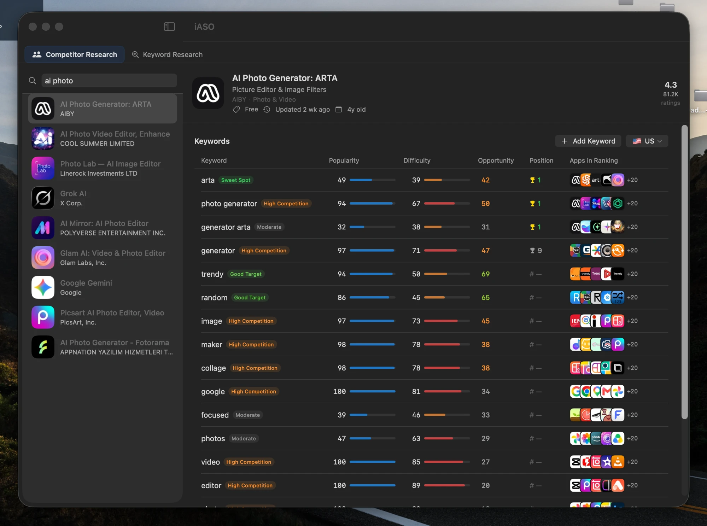

<div align="center">

# iASO

**App Store Optimization research tool for macOS.**  
Find high-opportunity keywords, analyze competitors, and generate metadata with AI.

[](https://www.apple.com/macos/) [](https://swift.org) [](https://developer.apple.com/xcode/swiftui/) [](LICENSE)

<br>



</div>

<br>

iASO is a native macOS app that helps indie developers and ASO professionals research App Store keywords without paying for expensive subscription tools. It queries the iTunes Search API directly, scores results with a pure algorithmic engine, and uses AI only where it genuinely adds value.

## Table of Contents

- [Features](#features)
- [Keyword Scoring](#keyword-scoring)
- [AI Integration](#ai-integration)
- [Getting Started](#getting-started)
- [Project Structure](#project-structure)
- [Contributing](#contributing)

## Features

- **Competitor Research** — Search any App Store app. The AI scrapes its subtitle and description, then extracts the keywords it targets.
- **Keyword Scoring** — Every keyword gets a Popularity, Difficulty, and Opportunity score (0–100), computed from live iTunes Search API results. No API key required.
- **Keyword Projects** — Create a project per app. Keywords are saved locally and persist between sessions. Switch country storefronts and rescore in one tap.
- **AI Name Generator** — Generate 4 App Name + Subtitle + Keyword Field combos, each respecting App Store Connect character limits (30 / 30 / 100).
- **Ads Research** — Check if a competitor is running ads on Apple Search Ads, Meta (Facebook/Instagram), and TikTok — searched in parallel.

## Keyword Scoring

Scores come from the iTunes Search API — no AI, no external service. iASO calls iTunes for each keyword, then runs multiple signals ported from [RespectASO](https://github.com/respectaso/respectaso):

| Keyword | Pop | Diff | Opp | Classification |
|---------|-----|------|-----|----------------|
| pomodoro | 44 | 28 | 85 | 🟢 Sweet Spot |
| brain training | 36 | 22 | 68 | 🔵 Hidden Gem |
| daily planner | 63 | 41 | 61 | 🔵 Good Target |
| meditation app | 72 | 68 | 38 | 🟠 High Competition |
| mindfulness | 81 | 74 | 22 | 🔴 Avoid |

**Classification rules:**
- **Sweet Spot** — pop ≥ 40, diff ≤ 40
- **Hidden Gem** — pop 25–39, diff ≤ 30, opp ≥ 30
- **Good Target** — opp ≥ 55
- **High Competition** — diff ≥ 65
- **Avoid** — opp ≤ 25

## AI Integration

iASO uses the [kie.ai](https://kie.ai) API — an OpenAI Responses API–compatible proxy that routes to GPT models. You need your own key to unlock the three AI-powered features.

### What uses AI, what doesn't

| Feature | Uses AI | Fallback when no key |
|---------|---------|----------------------|
| Keyword scoring (Pop / Diff / Opp) | No | Always works — iTunes Search API only |
| Keyword extraction from competitor | Yes | Algorithmic NLP via `NaturalLanguage.framework` |
| App Name + Subtitle + Keyword Field generation | Yes | Rule-based generator from scored keywords |
| Ads Research (Apple / Meta / TikTok) | Yes (web search) | Feature unavailable |

### How competitor analysis works

```
iTunes Search API
      │
      ▼
AI scrapes subtitle + description   ← requires API key
      │
      ▼
AI extracts keywords from text      ← requires API key
      │
      ▼
iTunes scores each keyword          ← free, no key needed
      │
      ▼
AI generates App Name combos        ← requires API key
```

### Configure your API key

Get a key at [kie.ai](https://kie.ai) — choose a plan that includes **Responses API** access and the **web_search** tool (needed for Ads Research). The free tier covers keyword extraction and name generation.

Open `iASO/Config.swift` and fill in your key:

```swift
import Foundation

enum Config {
    // Paste your kie.ai key here
    static let kieAPIKey: String = "YOUR_KIE_AI_API_KEY_HERE"

    // OpenAI Responses API–compatible endpoint
    static let kieAPIEndpoint: String = "https://api.kie.ai/codex/v1/responses"
}
```

All AI features read from `Config.kieAPIKey`. Every other feature works without a key.

### API request format

iASO uses the OpenAI Responses API schema. Ads Research additionally passes a `web_search` tool:

```json
{
  "model": "gpt-5-5",
  "stream": false,
  "reasoning": { "effort": "low" },
  "input": [
    { "role": "user", "content": [{ "type": "input_text", "text": "..." }] }
  ],
  "tools": [{ "type": "web_search" }]
}
```

## Getting Started

**1. Clone & open**

```bash
git clone https://github.com/YOUR_USERNAME/iASO.git
cd iASO
open iASO.xcodeproj
```

**2. Add your API key**

Open `iASO/Config.swift` and replace `"YOUR_KIE_AI_API_KEY_HERE"` with your kie.ai key. Leave it blank to use iASO in free mode — scoring and fallback name generation still work.

**3. Build & run**

Select the **iASO** scheme, choose *My Mac* as the target, and press `⌘R`. No additional dependencies — the project uses only Apple frameworks.

**4. Keep your key out of git**

Never commit a real API key. `Config.swift` is the only file you need to edit — consider adding it to `.gitignore` and using `Config.example.swift` as a template for contributors.

## Requirements

- macOS 14 Sonoma or later
- Xcode 15+
- Swift 5.9+
- No third-party Swift packages

## Project Structure

```
iASO/
├── Config.swift                  ← API key configuration (fill this in)
├── Models/
│   ├── AppResult.swift
│   ├── Keyword.swift
│   ├── KeywordProject.swift
│   ├── Competitor.swift
│   └── Suggestion.swift
├── Services/
│   ├── GPTService.swift          ← AI keyword extraction + name generation
│   ├── AdsResearchService.swift  ← Ads Research via AI web search
│   ├── ScoringEngine.swift       ← Algorithmic scoring (no AI)
│   ├── KeywordExtractor.swift    ← NLP keyword extraction (no AI)
│   ├── iTunesService.swift       ← iTunes Search API client
│   └── NameGenerator.swift       ← App name generation (AI + fallback)
├── ViewModels/
│   ├── ContentView.swift
│   ├── SearchView.swift
│   ├── CompetitorView.swift
│   ├── KeywordResearchViewModel.swift
│   ├── AdsResearchViewModel.swift
│   ├── GenerateView.swift
│   └── KeywordRow.swift
└── Views/
    ├── KeywordResearchView.swift
    ├── AdsResearchView.swift
    ├── FlowLayout.swift
    ├── SearchViewModel.swift
    └── CompetitorViewModel.swift
```

## Contributing

Pull requests are welcome. A few areas worth improving:

- **More storefronts** — the country picker covers ~60 App Store regions; edge cases may be missing
- **Rank tracking** — the `Keyword` model has a `position` field not yet surfaced in the UI
- **Export** — CSV or JSON export of keyword projects
- **Alternative AI providers** — `Config.swift` centralises the endpoint; point it at any OpenAI-compatible API (OpenAI, Anthropic, local Ollama, etc.)

## License

MIT — see [LICENSE](LICENSE) for details.

## Author

Built by **Orlando Nandito**

[](https://x.com/orlandonandito) [](https://www.linkedin.com/in/orlandonandito/)
